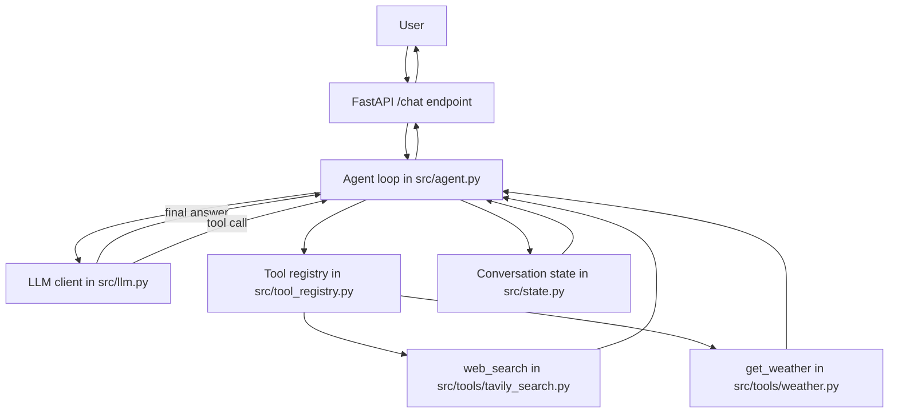

# Agent From Scratch

This project is a small FastAPI application that demonstrates how a single AI agent works internally without using agent frameworks such as LangChain, LangGraph, CrewAI, AutoGen, LlamaIndex agent abstractions, or the OpenAI Agents SDK.

The goal is learning. The code keeps the agent loop visible so you can see exactly how:

1. The LLM receives a user request.
2. The LLM decides whether a tool is needed.
3. Python detects the tool call.
4. Python executes the matching function.
5. The tool result is returned to the LLM.
6. The loop repeats until the model produces a final answer or the step limit is reached.

## Project Structure

```text
agent-from-scratch/
├── src/
│   ├── main.py
│   ├── agent.py
│   ├── llm.py
│   ├── state.py
│   ├── tool_registry.py
│   └── tools/
│       ├── __init__.py
│       ├── tavily_search.py
│       └── weather.py
├── tests/
│   ├── conftest.py
│   ├── test_agent.py
│   ├── test_tools.py
│   └── test_weather.py
├── .env.example
├── .gitignore
├── requirements.txt
└── README.md
```

## Getting Started

1. Create a virtual environment and install dependencies.
2. Copy `.env.example` to `.env` and set your API keys.
3. Run the app with Uvicorn.
4. Send a request to `POST /chat`.

Example:

```bash
python -m venv .venv
.venv\Scripts\activate
pip install -r requirements.txt
uvicorn src.main:app --reload
```

If you want to use `uv`, the equivalent command is:

```bash
uv run uvicorn src.main:app --reload
```

Do not run `uv run python main.py` for this repo. The FastAPI app lives in `src/main.py`, so the ASGI app path is `src.main:app`.

### Windows PowerShell quick start

```powershell
Set-Location D:\ICIEOS\agentic-task-orchestrator-API
python -m venv .venv
.venv\Scripts\Activate.ps1
pip install -r requirements.txt
uvicorn src.main:app --reload
```

### Try it out

Health check:

```powershell
Invoke-RestMethod http://127.0.0.1:8000/health
```

Direct question:

```powershell
Invoke-RestMethod -Method Post `
  -Uri http://127.0.0.1:8000/chat `
  -ContentType 'application/json' `
  -Body '{"message":"Explain what an API is."}'
```

Weather question:

```powershell
Invoke-RestMethod -Method Post `
  -Uri http://127.0.0.1:8000/chat `
  -ContentType 'application/json' `
  -Body '{"message":"What is the current weather in Colombo?"}'
```

## Environment Variables

Use these variables in `.env`:

```env
LLM_API_KEY=
LLM_API_BASE=https://api.openai.com/v1
LLM_MODEL=gpt-4.1-mini
TAVILY_API_KEY=
MAX_ITERATIONS=10
REQUEST_TIMEOUT_SECONDS=20
```

Open-Meteo does not require a key for the basic weather request.

## What Is an AI Agent?

An agent is not just an LLM.

### 1. LLM

The model receives a prompt and produces text. It can answer questions, but it cannot directly query the web or call external APIs by itself.

### 2. LLM + Tools

Now the model is allowed to request external capabilities such as web search or weather lookup.

This still is not fully an agent, because something outside the LLM must:

1. Recognize the tool request.
2. Run the correct function.
3. Return the result to the model.

### 3. LLM + Tools + Loop = Agent

The agent appears when you add the orchestration loop:

1. Send messages to the model.
2. Check whether the model requested a tool.
3. If yes, execute it.
4. Append the result to state.
5. Send the updated state back to the model.
6. Repeat until the model gives a final answer.

That loop is the core of this project.

## Architecture



## Tool Calling

Tool calling has four distinct pieces.

### 1. Tool definition

The tool definition is what you show to the LLM. It contains:

1. The tool name.
2. A description.
3. A parameter schema.

This is built in `src/tool_registry.py` and converted into the `tools` payload for the LLM.

### 2. Tool call

The tool call is what the LLM returns when it decides a tool is needed.

That response usually contains:

1. The tool name.
2. The tool arguments.
3. A tool call ID.

### 3. Python function

The Python function is the real executable implementation.

Examples:

1. `web_search(args)` in `src/tools/tavily_search.py`
2. `get_weather(args)` in `src/tools/weather.py`

### 4. Tool result

The tool result is the output of the Python function.

That result is appended to the message history with role `tool`, then sent back to the LLM.

### Why the schema exists

The schema tells the model what tools exist and what shape their inputs must have.

Without a schema, the LLM would not know:

1. Which tools are available.
2. What arguments are valid.
3. How to format a request for a tool.

### What happens internally

1. Python sends the available tool schemas to the LLM.
2. The LLM chooses a tool when it thinks one is helpful.
3. Python inspects the response.
4. Python parses the tool arguments.
5. Python looks up the matching function in the registry.
6. Python runs that function.
7. Python appends the result to the conversation.
8. Python sends the updated conversation back to the LLM.

### What would happen if tool calling were removed

The system would still answer direct questions, but it would not be able to fetch live data or use external services.

## Agent Loop

The agent loop lives in `src/agent.py`.

The loop is manual on purpose. It is not hidden behind a helper like `agent.run()` from a framework.

The loop works like this:

```text
User message
  -> add to state
  -> send messages to LLM
  -> LLM returns either:
	  - final answer
	  - one or more tool calls
  -> if final answer, stop
  -> if tool calls, for each tool call:
	  - parse arguments
	  - find Python function
	  - execute function
	  - append tool result to state
  -> send updated state back to LLM
  -> repeat
```

### Why the loop exists

The model often cannot finish in one response.

For example, if a user asks for weather, the model may need to:

1. Request the weather tool.
2. Receive the tool result.
3. Use the result to generate a final answer.

The loop is what makes that possible.

### What would happen if the loop were removed

You would get only a single model response.

That means tool calls would never be executed, tool results would never be fed back, and the model could not reason over tool output.

## State

State is the live object that stores everything the agent needs while it is running.

In this project, state is represented by `AgentState` in `src/state.py`.

It stores:

1. Message history.
2. Iteration count.
3. Tool calls seen so far.
4. The last tool name.
5. The last tool error.

### Why state is necessary

The agent needs a memory of what already happened in the conversation.

Without state, each LLM call would be isolated and the model would not know:

1. What the user just asked.
2. Which tool was already called.
3. What result the tool returned.
4. Whether a previous step failed.

### What happens internally

Every time the model replies, its message is appended to `messages`.

Every time a tool runs, a `tool` message is appended to `messages`.

The next LLM call receives the whole updated list.

### What would happen if state were removed

The model would forget the tool result immediately.

The loop would not work because each step would start from scratch.

## Conversation History vs Short-Term Memory vs Long-Term Memory

These terms are related but not the same.

### Conversation history

The list of messages exchanged in the current session.

This project stores that in `AgentState.messages`.

### Short-term memory

The useful context the agent carries forward during the active conversation.

In this project, short-term memory is effectively the same as conversation history.

That is enough for follow-up questions like:

1. What is the weather in Colombo?
2. What about tomorrow?

The second question only makes sense if the previous context remains available.

### Long-term memory

Persistent memory that survives across sessions.

Examples include:

1. Vector databases.
2. Profile stores.
3. Retrieval systems.

This project does not implement long-term memory yet.

### What would happen if you added no short-term memory

The agent would lose context between turns and follow-up questions would become ambiguous.

## Error Handling

The project uses simple, explicit error handling instead of heavy abstraction.

Handled cases include:

1. Tavily request failure.
2. Open-Meteo request failure.
3. Invalid tool arguments.
4. Unknown tool name.
5. Invalid JSON in tool arguments.
6. Unexpected tool response shape.
7. LLM returning malformed tool-call data.
8. Maximum iteration limit reached.

### Why simple error handling is enough here

This project is for understanding, not production hardening.

The code shows where failures happen and how they propagate instead of hiding them behind a framework.

### What happens internally on error

1. A tool function raises an exception or returns unexpected data.
2. The agent catches the exception.
3. The agent stores an error payload in the tool result message.
4. The updated state is sent back to the LLM if the loop can continue.

If the failure is unrecoverable, the agent raises `AgentError`.

## Stop Conditions

The agent must not run forever.

This project stops when one of these happens:

1. The LLM returns a final answer without tool calls.
2. The maximum iteration count is reached.
3. An unrecoverable error occurs.

### Why the iteration limit exists

An iteration limit prevents runaway loops caused by:

1. A model repeatedly requesting tools.
2. A tool failing and being retried endlessly.
3. A malformed conversation state.

The limit is a safety boundary and a debugging aid.

## Example Execution

Here is the conceptual flow for this request:

```text
User: What is the current weather in Colombo?
```

### Step 1: User message enters the agent

The message is appended to state.

### Step 2: LLM sees the message and tool schemas

The model decides it needs weather data.

### Step 3: LLM requests `get_weather`

The model returns a tool call with latitude and longitude.

### Step 4: Python detects the tool call

`src/agent.py` reads the response and sees `tool_calls`.

### Step 5: Python parses arguments

The JSON string is converted into a Python dictionary.

### Step 6: Python selects the function

The tool registry maps `get_weather` to `src/tools/weather.py`.

### Step 7: Python executes the function

The weather API is called with the parsed coordinates.

### Step 8: Python stores the result in state

A `tool` message is appended to the conversation.

### Step 9: The updated state goes back to the LLM

The model now has the tool result available.

### Step 10: LLM produces the final answer

The loop ends because no new tool call is requested.

## Tests

The test suite includes examples for:

1. No tool needed.
2. Weather tool use.
3. Unknown tool handling.
4. Multiple tools in sequence.
5. Tool failure handling.
6. Conversation state preservation.
7. Tool argument parsing.

Run them with:

```bash
pytest -q
```

## What Frameworks Hide From You

Frameworks such as LangChain or LangGraph normally hide a lot of the machinery that this project keeps visible.

They usually abstract away:

1. How tool schemas are built and passed to the model.
2. How tool-call messages are detected.
3. How arguments are parsed and validated.
4. How tool functions are dispatched.
5. How tool results are added back to message history.
6. How the loop repeats.
7. How state is persisted across turns.
8. How stop conditions are enforced.
9. How errors are represented and propagated.

Learning these pieces first is valuable because it shows what the framework is doing for you.

Once you understand the mechanics, framework behavior becomes easier to debug, evaluate, and replace if needed.

## Code Map

If you want to read the implementation in order, start here:

1. `src/main.py` for the HTTP entry point.
2. `src/agent.py` for the loop.
3. `src/llm.py` for LLM communication and argument parsing.
4. `src/tool_registry.py` for tool definitions.
5. `src/tools/tavily_search.py` for web search.
6. `src/tools/weather.py` for weather lookup.
7. `src/state.py` for state handling.

## Important Limitation

This repository shows the agent mechanism clearly, but the current implementation still needs real API keys and a reachable LLM endpoint to answer live questions through `/chat`.

The tests are designed to stay offline by using fake LLM responses and locally stubbed tools.

