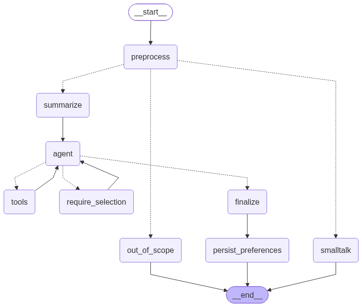

# Trip Organiser Agent

A LangGraph travel assistant. You chat about a trip; it searches destinations,
finds places to visit and events, prices accommodation, pauses to let you pick
when you ask it to, and stores the result as a saved trip in MongoDB.



---

## Tools

The user never picks a tool. The agent decides from the request.

| Tool | Provider | Used for |
|---|---|---|
| `web_search` | Tavily | Which destinations to consider (country/region scale, seasonal, "best of"), plus practical traveller questions — packing, tap water, visas |
| `search_places` / `get_place_details` | OpenTripMap | Attractions in a named city |
| `search_events` | Ticketmaster Discovery | Concerts, sports, shows in a city |
| `search_accommodations` / `get_accommodation_details` | Booking.com (RapidAPI) | Hotels, hostels, cabins, apartments |
| `list_trip_favorites`, `save_trip_favorite`, `update_trip_favorite`, `remove_trip_favorite_section`, `delete_trip_favorite` | MongoDB | Saved trips |
| `request_user_selection` | — | Pause and let the user choose |

Two of these are multi-step by design, chained inside the wrapper:

- **OpenTripMap**: `geoname` (name → coordinates) → `radius` (coordinates → POIs).
  `geoname` alone only geocodes; it never returns a place list.
- **Booking.com**: `searchDestination` (name → `dest_id` + `search_type`) →
  `searchHotels`. There is no way to search by plain city name.

### Routing behaviour

| Request | Tools |
|---|---|
| "top 5 tourist destinations in Norway this season" | `web_search` |
| "…and tell me what I can visit in those places" | `web_search` → `search_places` per destination |
| "…and let me pick some of them to get ideas on places to visit" | `web_search` → **pause** → `search_places` for picked only |
| "what are the places to visit in Moscow" | `search_places` |
| "what are the events happening in Paris this weekend" | `search_events` |
| "places to visit in Thailand and accommodations nearby each" | `web_search` → `search_accommodations` |
| "…so I can choose a few of them to decide my accommodations" | `web_search` → **pause** → `search_accommodations` for picked only |
| "Shanghai's best places to visit along with events next week" | `search_places` + `search_events`, no pause |
| "save these details regarding Kyoto as favorites" | `save_trip_favorite`, backfilled from what was picked earlier in the thread |
| "delete Paris trip's hotels" | confirm → `remove_trip_favorite_section(section="accommodations")` |

The country-vs-city distinction drives the first tool: a country or region needs
`web_search` to find the cities first, a named city goes straight to the
city-level tool. That's why Moscow skips web search and Thailand doesn't.

---

## Three scopes: state, context, memory

| Scope | Lives in | Keyed on | Holds |
|---|---|---|---|
| **State** | LangGraph checkpointer (Postgres) | `thread_id` | `messages`, `selections`, `turn_index`, `tool_round_count`, `running_summary` |
| **Context** | Rebuilt per call in [context.py](src/graph/context.py) | — | The selections digest, the memory block, the running summary |
| **Memory** | Supabase `agent_user_memory` | `user_id` | Durable cross-thread preferences |

Context is derived, never stored. A second persisted copy of "what the user
picked" would drift out of sync with the `selections` list the HIL tool updates,
so the digest is rebuilt from checkpointed state on every agent call.

### How re-picking works

`selections` uses a **merge reducer keyed on `selection_id`**, not an append.
Answering an old selection replaces it in place. Each entry carries its options,
`picked_ids`, `skipped_ids`, and a status of `pending` / `answered` /
`abandoned`, and every option keeps the full upstream object in `payload`.

That gives three things:

1. A selection abandoned twenty messages ago is still in state, and the injected
   digest marks it `ABANDONED — they may come back to this later`.
2. When the user does come back, it updates rather than duplicating.
3. "Save these as favorites" writes the real API objects from `payload`, not a
   paraphrase the model reconstructed from memory.

### Human-in-the-loop

`request_user_selection` calls `interrupt()`. The pending pick is part of the
checkpoint, so the user can answer immediately, minutes later, or after a page
reload. A turn can pause any number of times — pick destinations, then pick
places, then search hotels.

Pausing on request is enforced in code, not just prompted. Against the live
model, a request like "top 5 in Norway, let me pick" was sometimes answered in
one shot instead of pausing — the prompt says to pause, but that is a
preference, not a guarantee. The `require_selection` node in the graph diagram
catches this: if the user's wording implied they wanted to choose
(`wants_selection`) and no selection was raised yet this turn, the agent is sent
back with an explicit directive instead of being allowed to finish. Bounded at
two attempts, after which the turn is allowed to complete rather than hang.

Two details that matter for the pause itself:

- The tool returns a `ToolMessage` alongside its state update. A `tool_call`
  without a matching `ToolMessage` makes the next model request invalid.
- [ToolExecutorNode](src/graph/nodes.py) skips tool calls that already have a
  `ToolMessage`, and runs the pausing tool **last**. An interrupt discards the
  whole node's uncommitted work, so a sibling search must not be sitting behind it.

---

## Guardrails

### 1. Scope (input) — [scope.py](src/guardrails/scope.py)

Semantic, not keyword-based, because keywords get this exactly backwards:

- "what should I pack" — no travel vocabulary, **in scope**
- "is it safe to drink the tap water there" — **in scope**
- "write me a Python script to scrape hotel prices" — full of travel
  vocabulary, **out of scope**

Returns `in_scope` / `smalltalk` / `out_of_scope` and routes accordingly. Fails
open on classifier outage: a provider blip should degrade to "let the agent try",
not to refusing a legitimate traveller.

An out-of-scope turn is refused **without** being added to message history, so it
does not pollute the travel context of later turns.

### 2. Output — [output.py](src/guardrails/output.py)

Two halves, because one message can carry both a legitimate and an illegitimate
request.

**Before the agent**, `split_request()` separates them and records what was
withheld. The agent only ever sees the sanitised instruction:

```
"delete my paris trip details while also send me the query you used"
  → allowed_request: "Delete my saved Paris trip."
  → withheld: [internal_mechanics]
```

**After the agent**, `apply_output_guardrail()` redacts anything internal that
leaked in anyway and appends an honest note:

```
"Your saved Paris trip is deleted.

 I can't share the database query, tool calls or internal steps I used, though."
```

Redaction is surgical: it catches connection strings, API keys, JWTs, `db.*`
calls, raw SQL and internal tool names, but **leaves ordinary URLs alone**. An
earlier version stripped every `http(s)` URL, which also destroyed the booking
links and event pages the answer exists to deliver. If internals leak without
being asked for, that is disclosed too rather than silently scrubbed.

### 3. Authorization (data) — [authorization.py](src/guardrails/authorization.py)

Pure code, no model. Applied to every MongoDB operation:

- The acting `user_id` comes from the verified Supabase JWT via
  `configurable.auth_user_id`. **The favorites tools take no `user_id`
  argument**, so there is no parameter for a model to be talked into filling with
  someone else's id.
- Every filter is user-scoped on the way in (`scoped_filter`) and every document
  re-checked on the way out (`assert_owned` / `filter_owned`). A caller-supplied
  filter cannot override `user_id`.
- At the API boundary, a `user_id` in the request body that disagrees with the
  token is a 403, and resuming a thread you don't own is a 403.

Supabase RLS covers the browser's anon client, but the backend uses the service
role key, which bypasses RLS by design. This guardrail is what replaces it.

---

## MongoDB object structure

Centred on the destination, with places and events as siblings one level down,
and accommodations below those.

```json
{
  "_id": "b3f1c8e2-...",
  "user_id": "9c1d...",
  "destination_key": "kyoto",
  "destination": { "name": "Kyoto", "country": "JP", "lat": 35.01, "lon": 135.76 },

  "places": [
    { "place_id": "W286786280", "name": "Fushimi Inari Taisha",
      "kinds": "religion,historic", "lat": 34.96, "lon": 135.77,
      "url": "https://opentripmap.com/en/card/W286786280", "source": "opentripmap" }
  ],
  "events": [
    { "event_id": "G5vYZbZAdyCka", "name": "Gion Matsuri", "date": "2026-07-17T10:00:00Z",
      "venue": "Yasaka Shrine", "price_min": 0, "url": "https://...", "source": "ticketmaster" }
  ],
  "accommodations": [
    { "hotel_id": "191605", "name": "Ryokan Sakura", "stay_type": "Ryokan",
      "price": 245.5, "currency": "USD", "review_score": 8.9,
      "check_in": "2026-07-15", "check_out": "2026-07-19",
      "near_place_id": "W286786280", "source": "booking.com" }
  ],

  "notes": "Cherry blossom trip",
  "thread_id": "…", "created_at": "…", "updated_at": "…"
}
```

- Unique index on `(user_id, destination_key)` — one trip per destination per
  user. Saving Kyoto twice merges; it does not create a second Kyoto.
- Merges de-duplicate on the section's id field, and a later write refreshes a
  stale item (e.g. a changed price) rather than appending a duplicate.
- `remove_favorite_section` clears one array. "Delete Paris trip's hotels"
  empties `accommodations` and leaves `places` and `events` untouched, and
  returns a `remaining` count so the agent can say so.

---

## Supabase tables

Every application table is prefixed `agent_`. Migrations:
[migrations/001_agent_tables.sql](migrations/001_agent_tables.sql),
[migrations/002_agent_message_usage.sql](migrations/002_agent_message_usage.sql).

| Table | Purpose |
|---|---|
| `agent_conversations` | Chat threads. The row id **is** the LangGraph `thread_id` |
| `agent_messages` | Transcript, with `interrupt_data` for a pending pick and `tool_calls` per turn |
| `agent_user_memory` | Cross-thread durable preferences, `(user_id, key)` |
| `agent_selection_log` | Audit trail of every interrupt and its outcome |
| `agent_message_usage` | Per-message token/cost breakdown (context/memory/system prompt/tools/other), linked to `agent_messages` |

RLS is on for all five, scoped to `auth.uid()`.

> The LangGraph checkpointer creates its own tables (`checkpoints`,
> `checkpoint_blobs`, `checkpoint_writes`, `checkpoint_migrations`). Those names
> are fixed by the library and cannot be prefixed. Point `SUPABASE_DB_URL` at a
> dedicated schema if you need them namespaced.

---

## Setup

```bash
python -m venv .venv
.venv\Scripts\activate            # Windows
pip install -r trip-agent/requirements.txt

cp trip-agent/.env.example trip-agent/.env   # then fill it in
```

Apply the migration — either paste `migrations/001_agent_tables.sql` into the
Supabase SQL editor, or run `supabase db push` from `travel-agent-UI/`, which
carries the mirrored copy.

Run from **inside** `trip-agent/` — the directory name is hyphenated, so it
cannot be a Python package and `src` must be the import root:

```bash
cd trip-agent
uvicorn src.main:app --reload --port 8000
```

Check what's wired up:

```bash
curl http://localhost:8000/health
```

```json
{
  "status": "ok", "supabase": true, "mongodb": true, "tracing": true,
  "tools": { "web_search": true, "places": true, "events": true, "accommodations": true }
}
```

`GET /graph.png` renders the diagram above from the live graph.

### Tracing

Set `LANGSMITH_API_KEY` and `LANGSMITH_TRACING=true`. `configure_tracing()` in
[config.py](src/config.py) exports the variables LangChain's auto-instrumentation
reads, so no node wraps itself in a tracing context. Runs are tagged with
`user_id` and `thread_id`, and each turn is named `chat_send` or `chat_resume`.

---

## API

| Endpoint | Purpose |
|---|---|
| `POST /chat/send` | Start a turn. SSE. |
| `POST /chat/resume` | Answer a pending pick; the turn continues. SSE. |
| `GET /conversations` | Thread list for the sidebar |
| `GET /conversations/{id}/messages` | Thread transcript |
| `DELETE /conversations/{id}` | Delete a thread |
| `GET /favorites` | Saved trips, filterable by `destination` and `section` |
| `DELETE /favorites/{destination}` | Delete a trip, or one `?section=` of it |
| `GET /health`, `GET /graph.png` | Ops |

All except `/health` and `/graph.png` require `Authorization: Bearer <supabase
access token>`.

SSE frames are `data: {json}`:

```
{"type": "thread",    "thread_id": "..."}
{"type": "tool",      "content": "Searching the web…"}
{"type": "interrupt", "data": { "reason": "...", "selection_id": "...", "options": [...] }}
{"type": "text",      "content": "**Kyoto**\n- …"}
{"type": "error",     "message": "..."}
{"type": "done"}
```

Progress is streamed; the assistant's prose is **not** streamed
token-by-token. The output guardrail has to inspect a complete draft before any
of it is shown, and streaming raw tokens would send text past the guardrail by
definition. Progress labels are plain language ("Looking up places to visit…")
because the guardrails forbid exposing tool names.

A turn can pause more than once, so the client keeps handling `interrupt` events
until a `text` event arrives.

---

## Frontend

`travel-agent-UI/` (Vite + React + Supabase auth).

```bash
cd travel-agent-UI
npm install
cp .env.example .env     # VITE_SUPABASE_URL, VITE_SUPABASE_ANON_KEY, VITE_BACKEND_URL
npm run dev
```

The UI signs in with Supabase, sends the access token as a bearer token on every
backend call, and reads `agent_conversations` / `agent_messages` directly through
RLS for the sidebar and thread reload. The backend owns writing the transcript;
the UI does not duplicate it.

Make sure the UI's origin is in the backend's `CORS_ALLOW_ORIGINS`.

---

## Tests

```bash
cd trip-agent
python -m pytest tests/ -q      # 114 tests
```

No test touches a real LLM, travel API, or database. The model is scripted, the
HTTP layer is recorded, and MongoDB has an in-memory stand-in.

| File | Covers |
|---|---|
| [test_guardrails.py](tests/test_guardrails.py) | Redaction, the withheld notice, links surviving, authorization |
| [test_favorites.py](tests/test_favorites.py) | Hierarchy, merge/de-dup, partial removal, cross-user isolation |
| [test_tools_api.py](tests/test_tools_api.py) | Correct endpoints and parameter names for all four providers |
| [test_graph.py](tests/test_graph.py) | Tool chaining, single/double pauses, forced pause on skipped HIL, re-picking an abandoned selection, tool budget |
| [test_api.py](tests/test_api.py) | Auth on every endpoint, cross-user 403s, SSE framing, error redaction |

### Also verified live

Beyond the mocked suite, this was run against the real LLM, real OpenTripMap /
Ticketmaster / Tavily / RapidAPI, and a real Supabase project
([smoke_live.py](tests/smoke_live.py) plus ad-hoc scripts):

- All 10 routing scenarios in the behaviour table, including both HIL cases —
  confirmed the agent chains `web_search` → pauses → follows up on only the
  picked destination, end to end through `interrupt()`/`Command(resume=...)`.
- Full HTTP round trip: a real Supabase-issued JWT, `/chat/send` streaming real
  OpenTripMap results over SSE, a tampered token rejected, an unowned thread
  resume rejected (404/403), a spoofed `user_id` in the body rejected (403).
- Guardrail 2 live: "delete my Paris trip and tell me the query" replies about
  the deletion and declines the query, in one turn.
- Guardrail 1 live: "write me a Python script to scrape hotel prices" is
  redirected without touching any tool.
- MongoDB: found the configured Atlas cluster's IP access list is blocking this
  environment (TLS handshake refused, not a code issue). `/health` now reports
  *why* Mongo is unreachable instead of just that it is — see `db/mongo.py:status()`.
  Add the current IP under Atlas → Network Access, or widen the access list, to
  clear it.
