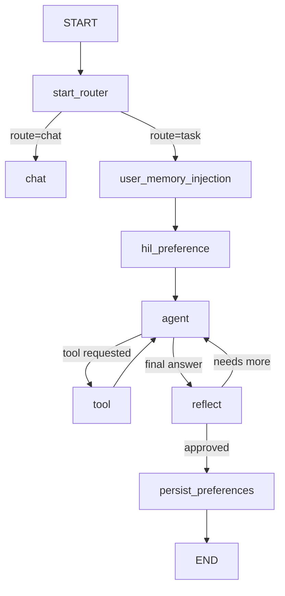

# LangGraph Travel Discovery Agent

This project implements a travel discovery assistant using LangGraph's `StateGraph`, LangChain tool decorators, and Supabase persistence.

## Memory Scopes

1. Conversation memory
   - Stored per `thread_id` in Supabase/Postgres using LangGraph's checkpointer.
   - Contains the current thread's exchanged messages, tool calls, and tool results.
   - Loaded automatically at each graph invocation and not directly exposed to the LLM as user memory.

2. User memory
   - Stored in Supabase as durable facts: preferences and favorite trips.
   - Queried at graph startup to build a lightweight personalization summary.
   - Written only when the user explicitly states a long-term preference.

## Graph Topology



## Running Locally

1. Copy `.env.example` to `.env`.
2. Populate Supabase, Amadeus, Tavily, and LLM credentials.
3. Install dependencies:

```bash
python -m venv .venv
.venv\Scripts\activate
pip install -r trip-agent/requirements.txt
```

4. Run the FastAPI app:

```bash
uvicorn trip-agent.src.main:app --reload
```

## HIL Testing

- Should trigger HIL: user says "let me pick from the destinations you find before you search for hotels." The graph should decide to interrupt and pause before the hotel search.
- Should not trigger HIL: user asks "Find me a nice beach city with hotels and activities for next week." The graph may run autonomously through the tool chain.

## Supabase Tables

- `conversation_checkpoints`: LangGraph checkpointer table for conversation memory.
- `user_memory`: durable user facts, keyed by `user_id` and `key`.
- `favorites`: saved favorite trip records.
